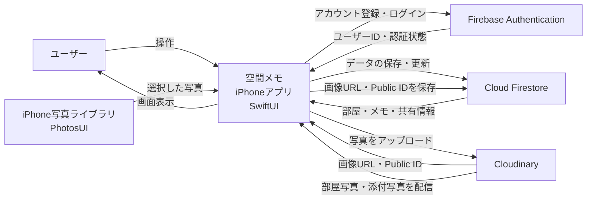

## システム構成設計

### システム構成の概要

「空間メモ」は、SwiftUIで作成するiPhoneアプリと、以下の外部サービスで構成する。

- Firebase Authentication
- Cloud Firestore
- Cloudinary
- iPhoneの写真ライブラリ

### システム構成図




### 各構成要素の役割

| 構成要素 | 役割 |
|---|---|
| ユーザー | アプリを操作し、部屋やメモを登録・確認する |
| iPhoneアプリ | 画面表示、入力受付、データ処理、外部サービスとの通信を行う |
| PhotosUI | iPhoneの写真ライブラリから写真を選択する |
| Firebase Authentication | アカウント登録、ログイン、ログアウト、ユーザー識別を行う |
| Cloud Firestore | ユーザー、部屋、メモ、共有情報、画像URLを保存・同期する |
| Cloudinary | 部屋写真とメモの添付写真を保存・配信する |

## データの流れ

### 1. アカウント登録・ログイン

```text
ユーザー
    ↓ メールアドレス・パスワード
iPhoneアプリ
    ↓ 認証要求
Firebase Authentication
    ↓ ユーザーID・認証結果
iPhoneアプリ
```

Firebase Authenticationから取得したユーザーIDを、Cloud Firestore上のユーザー、部屋、メモ、共有情報の識別に使用する。

### 2. 部屋・メモの保存

```text
ユーザー
    ↓ 部屋・メモを入力
iPhoneアプリ
    ↓ 保存
Cloud Firestore
    ↓ 保存結果
iPhoneアプリ
```

Cloud Firestoreには、以下のデータを保存する。

- ユーザー情報
- 部屋情報
- メモ情報
- ピンの位置
- ピンカラー
- 所有者情報
- 共有ユーザー情報
- Cloudinaryの画像URL
- CloudinaryのPublic ID
- 作成日時
- 更新日時

### 3. 写真の保存

```text
iPhone写真ライブラリ
    ↓ 写真を選択
iPhoneアプリ
    ↓ 写真をアップロード
Cloudinary
    ↓ 画像URL・Public ID
iPhoneアプリ
    ↓ URL・Public IDを保存
Cloud Firestore
```

写真本体はCloud Firestoreへ保存せず、Cloudinaryへ保存する。

Cloud Firestoreには、Cloudinaryから返された画像URLとPublic IDだけを保存する。

### 4. 写真の表示

```text
Cloud Firestore
    ↓ 画像URLを取得
iPhoneアプリ
    ↓ 画像を要求
Cloudinary
    ↓ 画像を配信
iPhoneアプリ
```

### 5. 複数端末での同期

```text
端末A
    ↓ データを保存
Cloud Firestore
    ↓ データを同期
端末B
```

同じFirebase Authenticationのアカウントでログインすることで、別端末から同じ部屋とメモを取得する。

### 6. 他のユーザーとの共有

```text
部屋の所有者
    ↓ 共有相手を指定
Cloud Firestore
    ↓ 共有情報を保存
共有ユーザー
    ↓ 共有された部屋を取得
Cloud Firestore
```

Cloud Firestoreのセキュリティルールを使用し、部屋の所有者と共有ユーザーだけが対象データへアクセスできるようにする。

## システム間の接続

| 接続元 | 接続先 | 処理内容 |
|---|---|---|
| iPhoneアプリ | Firebase Authentication | アカウント登録、ログイン、ログアウト |
| Firebase Authentication | iPhoneアプリ | ユーザーID、認証状態、認証結果 |
| iPhoneアプリ | Cloud Firestore | データの登録、取得、更新 |
| Cloud Firestore | iPhoneアプリ | ユーザー、部屋、メモ、共有情報 |
| iPhone写真ライブラリ | iPhoneアプリ | 選択した写真データ |
| iPhoneアプリ | Cloudinary | 部屋写真・添付写真のアップロード |
| Cloudinary | iPhoneアプリ | 画像URL、Public ID、画像データ |
| iPhoneアプリ | Cloud Firestore | Cloudinaryの画像URLとPublic IDの保存 |

## セキュリティ上の前提

- Firebase Authenticationで認証されたユーザーだけがデータを操作する
- パスワードはiPhoneアプリやCloud Firestoreへ保存しない
- Cloud Firestoreのセキュリティルールでアクセスを制限する
- 部屋の所有者と共有ユーザーだけが部屋とメモを取得できるようにする
- CloudinaryのAPI SecretをアプリやGitHubへ保存しない
- MVPのUnsigned Uploadには、ファイル形式、容量、解像度の制限を設定する
- CloudinaryとCloud Firestoreは直接通信せず、iPhoneアプリが画像情報を受け渡す
