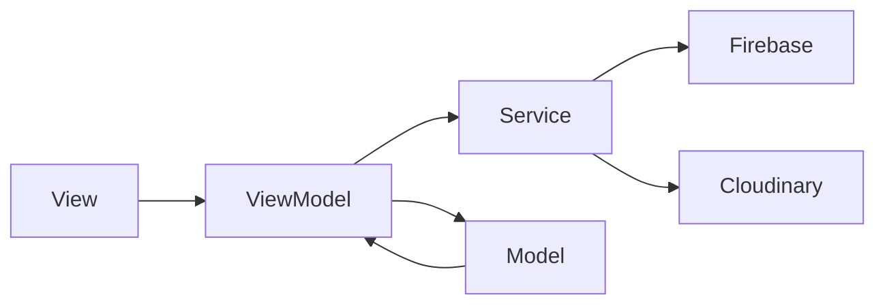
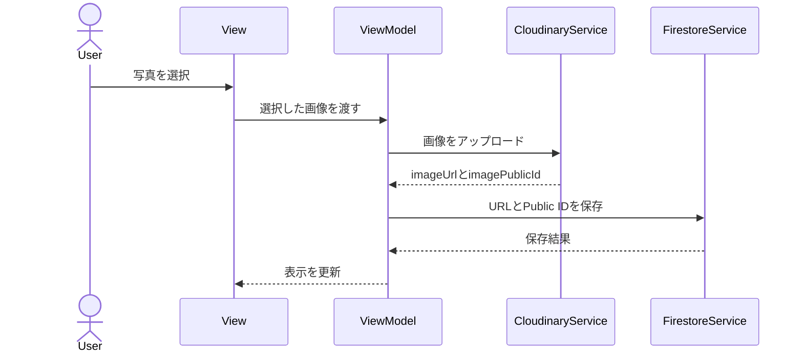

# アプリ構成設計

## 1. 概要

空間メモは、SwiftUIとMVVMを使用して実装する。

画面表示、画面の状態、FirebaseやCloudinaryとの通信を分離し、機能ごとの責任を明確にする。

## 2. 使用技術

| 分類 | 使用技術 |
|---|---|
| 言語 | Swift |
| UI | SwiftUI |
| 設計パターン | MVVM |
| 非同期処理 | Swift Concurrency |
| アカウント管理 | Firebase Authentication |
| データ保存 | Cloud Firestore |
| 画像保存 | Cloudinary |
| 写真選択 | PhotosUI |
| 画面遷移 | NavigationStack |

## 3. MVVMの構成



### Model

アプリ内で扱うデータの構造を定義する。

- AppUser
- Room
- Memo
- RoomMember
- PinColor

### View

画面の表示とユーザー操作の受け付けを担当する。

ViewからFirebaseやCloudinaryを直接操作しない。

### ViewModel

画面の状態と処理を管理する。

- 入力内容の保持
- 入力チェック
- ローディング状態の管理
- Serviceの呼び出し
- 成功・失敗結果のViewへの通知

### Service

FirebaseやCloudinaryなど、外部サービスとの通信を担当する。

- ログイン
- Firestoreへの保存と取得
- Cloudinaryへの画像アップロード
- 共有ユーザーの検索と登録

## 4. 依存関係

```text
View
  ↓
ViewModel
  ↓
Service
  ↓
Firebase・Cloudinary
```

上位の層から下位の層だけを呼び出す。

```text
許可：View → ViewModel
許可：ViewModel → Service
禁止：View → Firebase
禁止：View → Cloudinary
```

## 5. Model一覧

| Model | 役割 |
|---|---|
| AppUser | ユーザー情報を表す |
| Room | 部屋情報を表す |
| Memo | メモ情報とピン位置を表す |
| RoomMember | 部屋の共有情報を表す |
| PinColor | 10色のピンカラーを表す |
| AppError | アプリ内のエラーを表す |

Swift標準の`User`型などとの混同を避けるため、ユーザーModel名は`AppUser`とする。

## 6. View一覧

| View | 画面ID | 役割 |
|---|---|---|
| RootView | − | ログイン状態によって最初の画面を切り替える |
| LoginView | SCR-001 | ログイン画面 |
| AccountRegistrationView | SCR-002 | アカウント登録画面 |
| RoomListView | SCR-003 | 部屋一覧画面 |
| RoomRegistrationView | SCR-004 | 部屋登録画面 |
| RoomDetailView | SCR-005 | 部屋画像とメモピンを表示する |
| MemoEditorView | SCR-006 | メモの登録と編集を行う |
| SharingManagementView | SCR-007 | 共有ユーザーを管理する |
| SettingsView | SCR-008 | アカウントとアプリ情報を表示する |

## 7. ViewModel一覧

| ViewModel | 使用するView | 主な役割 |
|---|---|---|
| AuthViewModel | RootView、LoginView、AccountRegistrationView | ログイン状態、登録、ログイン、ログアウトを管理する |
| RoomListViewModel | RoomListView | 部屋一覧を取得する |
| RoomRegistrationViewModel | RoomRegistrationView | 部屋名、部屋写真、部屋登録を管理する |
| RoomDetailViewModel | RoomDetailView | 部屋詳細、メモ一覧、ピン表示、画像変更を管理する |
| MemoEditorViewModel | MemoEditorView | メモ入力、カラー、添付写真、保存を管理する |
| SharingViewModel | SharingManagementView | 共有メンバーの取得と追加を管理する |
| SettingsViewModel | SettingsView | ユーザー情報とアプリ情報を管理する |

## 8. Service一覧

| Service | 役割 |
|---|---|
| AuthService | Firebase Authenticationの登録、ログイン、ログアウトを行う |
| UserService | Firestoreのユーザー情報を保存・取得する |
| RoomService | Firestoreの部屋情報を保存・取得・更新する |
| MemoService | Firestoreのメモ情報を保存・取得・更新する |
| SharingService | Firestoreの共有情報を保存・取得する |
| CloudinaryService | Cloudinaryへ画像をアップロードする |

REST APIを実装する場合も、ViewとViewModelは変更せず、Serviceの内部をAPI通信へ置き換えられる構成にする。

## 9. フォルダ構成

```text
SpaceMemo
├── App
│   ├── SpaceMemoApp.swift
│   └── RootView.swift
│
├── Models
│   ├── AppUser.swift
│   ├── Room.swift
│   ├── Memo.swift
│   ├── RoomMember.swift
│   ├── PinColor.swift
│   └── AppError.swift
│
├── Views
│   ├── Auth
│   │   ├── LoginView.swift
│   │   └── AccountRegistrationView.swift
│   ├── Rooms
│   │   ├── RoomListView.swift
│   │   ├── RoomRegistrationView.swift
│   │   └── RoomDetailView.swift
│   ├── Memos
│   │   └── MemoEditorView.swift
│   ├── Sharing
│   │   └── SharingManagementView.swift
│   ├── Settings
│   │   └── SettingsView.swift
│   └── Components
│       ├── RoomCardView.swift
│       ├── MemoPinView.swift
│       └── PinColorPickerView.swift
│
├── ViewModels
│   ├── AuthViewModel.swift
│   ├── RoomListViewModel.swift
│   ├── RoomRegistrationViewModel.swift
│   ├── RoomDetailViewModel.swift
│   ├── MemoEditorViewModel.swift
│   ├── SharingViewModel.swift
│   └── SettingsViewModel.swift
│
├── Services
│   ├── AuthService.swift
│   ├── UserService.swift
│   ├── RoomService.swift
│   ├── MemoService.swift
│   ├── SharingService.swift
│   └── CloudinaryService.swift
│
├── Utilities
│   ├── Constants.swift
│   └── ImageValidator.swift
│
└── Resources
    ├── Assets.xcassets
    └── GoogleService-Info.plist
```

## 10. 画面状態

各ViewModelでは、必要に応じて次の状態を管理する。

| 状態 | 説明 |
|---|---|
| isLoading | 通信中かどうか |
| errorMessage | ユーザーへ表示するエラーメッセージ |
| isSaving | 保存処理中かどうか |
| selectedImage | 選択された画像 |
| isPresented | シートや画面を表示しているか |

通信中はボタンの連続タップを防止する。

## 11. 非同期処理

FirebaseとCloudinaryの処理にはSwift Concurrencyを使用する。

```text
ユーザー操作
  ↓
ViewModel
  ↓
async処理を開始
  ↓
Service
  ↓
FirebaseまたはCloudinary
  ↓
結果をViewModelへ返す
  ↓
Viewを更新
```

ViewModelはUIの状態を変更するため、原則として`@MainActor`で動作させる。

## 12. 画像保存の流れ



実装時には`FirestoreService`を、保存対象に応じて`RoomService`または`MemoService`として扱う。

## 13. ログイン状態による画面切り替え

```text
アプリ起動
  ↓
Firebase Authenticationのログイン状態を確認
  ├─ 未ログイン → LoginView
  └─ ログイン済み → RoomListView
```

`RootView`がログイン状態を監視し、表示する画面を切り替える。

## 14. 実装方針

- 画面と外部サービスの処理を分離する
- Viewには複雑な処理を書かない
- ViewModelから直接画面部品を操作しない
- Serviceは画面表示について判断しない
- FirebaseやCloudinaryのエラーをユーザー向けの文章へ変換する
- API Secretや秘密情報をソースコードへ書かない
- 実装は機能ごとに小さく進め、その都度動作確認する
