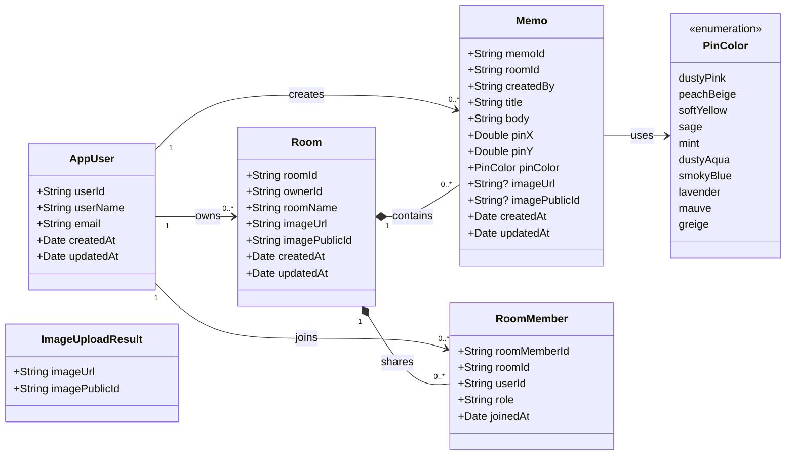
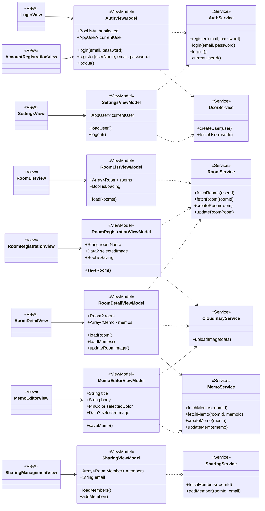

# クラス図

## 1. 概要

空間メモを構成するModel、View、ViewModel、Serviceの関係を示す。

図が複雑になることを防ぐため、Modelクラス図とMVVM構成図を分けて作成する。

## 2. Modelクラス図

`ImageUploadResult`はCloudinaryへのアップロード結果を一時的に受け取るためのModelであり、Firestoreにはそのまま保存しない。

## 3. MVVM構成図

## 4. クラスの種類

| 種類 | Swiftでの形式 | 役割 |
|---|---|---|
| Model | `struct`または`enum` | アプリで扱うデータを表す |
| View | `struct` | SwiftUIの画面を表示する |
| ViewModel | `class` | 画面状態と処理を管理する |
| Service | `class` | FirebaseやCloudinaryとの通信を行う |

## 5. 矢印の意味

| 表記 | 意味 |
|---|---|
| `View → ViewModel` | ViewがViewModelを使用する |
| `ViewModel ⇢ Service` | ViewModelがServiceを呼び出す |
| `1 → 0..*` | 1件のデータが0件以上のデータと関係する |
| `◆` | 親データが子データを所有する関係 |
